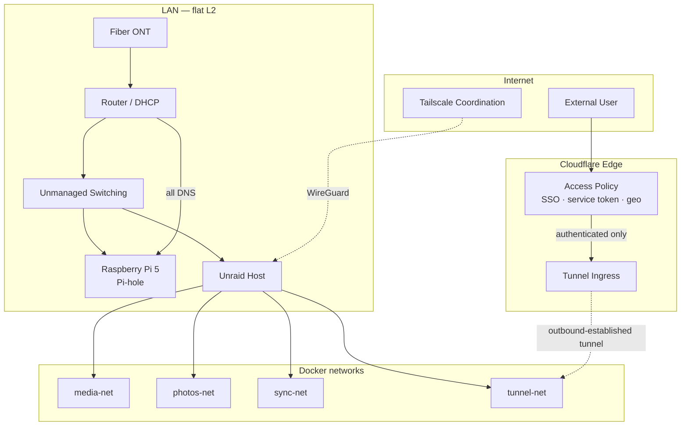

# Self-Hosted Infrastructure — Security Documentation

Documentation for a self-hosted environment I design, operate, and secure. Organized around
**controls and the threats they address**, not service installation guides.

> Hostnames, domains, and internal addressing are sanitized. Certificate transparency logs
> already expose subdomains for any public certificate, so this is not a secrecy control —
> it avoids publishing a single convenient inventory mapping services to software and versions.
> Service-level configuration lives in a private repository.

---

## Environment

| | |
|---|---|
| **Compute** | Unraid server (i7-12700K, 32 GB RAM), Raspberry Pi 5 |
| **Storage** | 40 TB raw, single-parity; NVMe cache and application-data tiers |
| **Network** | Fiber ONT → mesh router → unmanaged switching (flat layer 2) |
| **Public ingress** | Cloudflare Tunnel + Cloudflare Access (SSO, service tokens, geo-restriction) |
| **Administrative access** | Tailscale / WireGuard mesh |
| **DNS** | Pi-hole, network-wide, sole resolver |
| **Workloads** | ~15 containers across four isolated Docker networks |

---

## Architecture

Two properties do most of the work:

**Ingress is outbound-established.** The tunnel daemon dials Cloudflare; nothing listens on the
WAN edge. A scan of the residential IP finds no service to attack.

**Authentication happens before the application sees the request.** Every published route sits
behind an Access policy — Google SSO against a whitelisted account list for browser clients,
service tokens for programmatic ones, with non-US traffic rejected by default. A vulnerability
in a published application is not reachable by an unauthenticated caller. This is the
distinction between *no open ports* and *zero trust*; the tunnel provides the first, Access
provides the second.

Administrative planes — the Unraid web UI, SSH, the Docker socket — are never published and are
reachable only across the WireGuard mesh.

---

## Controls

| # | Control | Threat addressed | State |
|---|---|---|---|
| [01](docs/controls/01-external-access.md) | Tunnel ingress, no persistent inbound ports | Internet-wide scanning, direct exploitation | Implemented |
| [02](docs/controls/02-identity-and-access.md) | Identity-aware proxy: SSO, service tokens, geo | Unauthenticated access to published apps | Implemented |
| [03](docs/controls/03-dns-filtering.md) | Resolver-layer sinkholing | Telemetry, malvertising, known-bad domains | Implemented |
| [04](docs/controls/04-segmentation.md) | Per-stack container networks | Lateral movement between workloads | Partial |
| [05](docs/controls/05-backup-and-recovery.md) | Parity, versioned immutable offsite copy | Hardware failure, deletion, ransomware | In progress |
| [06](docs/controls/06-monitoring-and-detection.md) | Log aggregation, off-host alerting | Undetected compromise | Partial |
| [07](docs/controls/07-vulnerability-management.md) | Package inventory against CVE feed | Exploitation of known vulnerabilities | Partial |

- [Threat model](docs/threat-model.md) — assets, adversaries, coverage, accepted risk
- [Roadmap](docs/roadmap.md) — open gaps, prioritized
- [Findings](docs/findings/) — investigation write-ups and analysis

---

## Why organized this way

Most home lab write-ups are service catalogs. This one is organized by control because that is
how the work gets evaluated operationally, and because writing down an accepted risk is what
separates a decision from an oversight.

Incomplete controls are documented as incomplete. Where a control is weaker than it appears —
the geo-restriction, for instance, which any adversary with a VPN walks through — it is
described as what it is.
